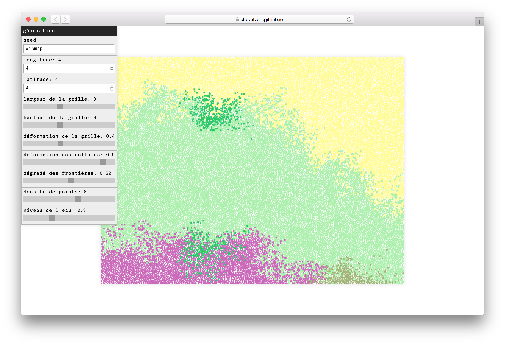

# wipmap-builder [](http://chevalvert.fr/)
> A webpage to create and preview `wipmap` maps presets



## Development

```sh
git clone git@github.com:chevalvert/wipmap-builder.git
cd wipmap-builder
yarn install
yarn start
```

## License
[MIT.](https://tldrlegal.com/license/mit-license)
